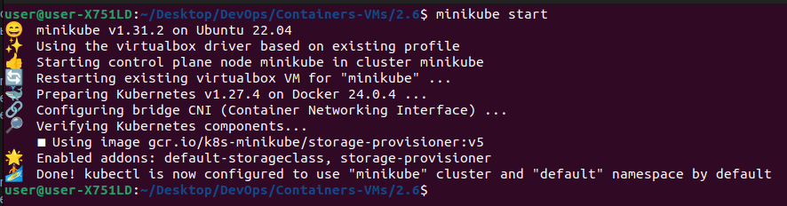
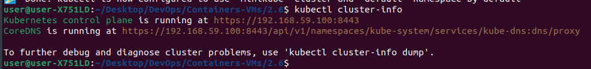
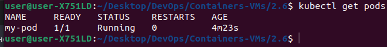
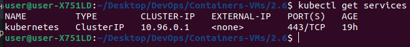
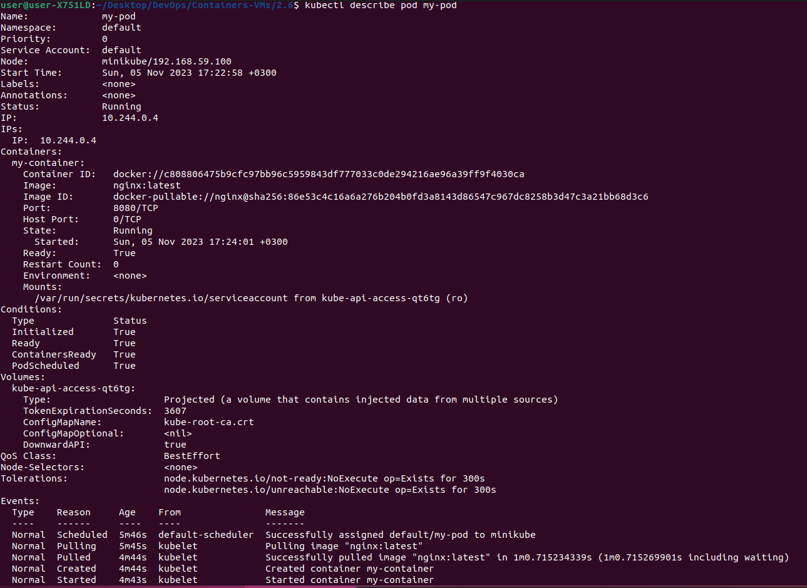
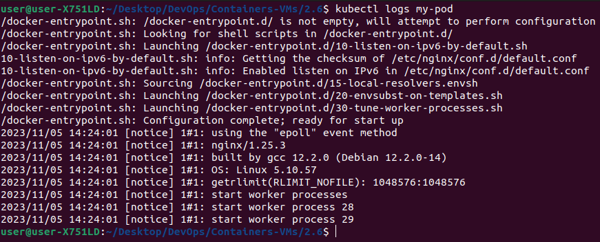
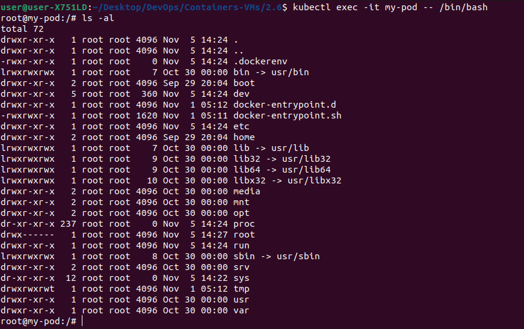
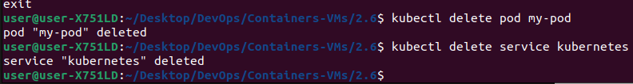

# Знакомство с Kubernetes и Minikube

### Запуск Minikube

Для создания и запуска локального Minikube-кластера использована команда: **minikube start**.



### Проверка состояния кластера

Для проверки состояния кластера была использована команда **kubectl cluster-info**.



### Создание и запуск пода

Был создан файл манифеста для пода **my-pod.yaml**.

```
apiVersion: v1
kind: Pod
metadata:
  name: my-pod
spec:
  containers:
  - name: my-container
    image: nginx:latest
    ports:
    - containerPort: 8080
```

**apiVersion: v1**: поле указывает версию API Kubernetes, с которой работает этот манифест.

**kind: Pod**: поле определяет тип ресурса, который мы создаем (Pod). Поды являются наименьшей управляемой единицей в Kubernetes и представляют собой одну или несколько контейнеров, разделяющих один и тот же сетевой и хранилище пространство.

**metadata**: здесь указываются метаданные для создаваемого Pod. В данном случае, имя Pod установлено как "my-pod". Метаданные обеспечивают идентификацию и организацию ресурсов в Kubernetes.

**spec**: раздел определяет спецификацию (конфигурацию) создаваемого Pod.
* **containers**: Внутри spec определены контейнеры, которые будут запущены внутри этого Pod. Этот контейнер будет использовать образ Nginx для запуска.
* **ports**: часть спецификации контейнера в манифесте Kubernetes, которая определяет порты, используемые контейнером. 
    * **containerPort**: поле определяет порт, который контейнер внутри Pod будет слушать для входящих сетевых соединений.

После создания манафеста используется команда **kubectl create -f my-pod.yaml** которая запустит под в кластере.

### Проверка пода и сервиса

Команда проверки состояния своего пода **kubectl get pods**



Команда проверки состояния своего сервиса **kubectl get services**



Команда для получения дополнительной информации о поде **kubectl describe pod my-pod**



### Журналы и отладка

Команда для просмотра журналов пода **kubectl logs my-pod**

\

Команда для отладки внутри контейнера пода **kubectl exec -it my-pod -- /bin/bash**



### Остановка и удаление ресурсов

Для остановки и удаления пода и сервиса используются команды **kubectl delete pod my-pod** **kubectl delete service kubernetes**



### Остановка Minikube 
Для остановки локального мини-кластера Kubernetes использована команда **minikube stop**.